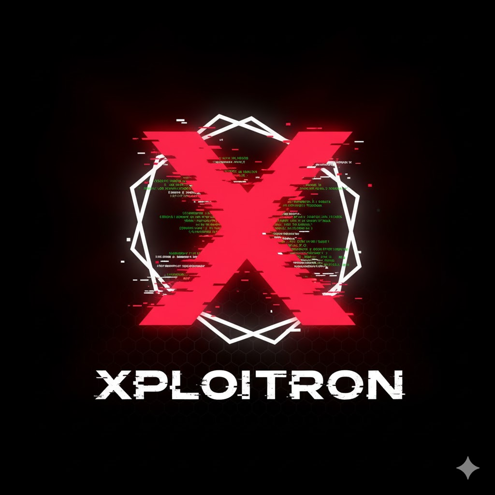

# Xploitron

<p align="center">
  
</p>

<p align="center">
  <strong>A modular, AI-powered security scanner for modern web applications.</strong>
</p>

<p align="center">
    
    
    
</p>

-----

## 🚀 About Xploitron

Xploitron is a penetration testing tool designed to automate the discovery of web application vulnerabilities. It leverages **Playwright** for robust, headless browser automation and a local **Large Language Model (LLM)** for intelligent, context-aware payload generation. Its modular architecture allows for easy expansion with new attack types.

-----

## ✨ Key Features

  * **Dynamic Input Discovery:** Automatically finds and tests all input fields, text areas, and search bars on a page.
  * **Recursive Crawling:** Intelligently spiders the target site to discover all in-scope pages, respecting the initial domain and port.
  * **Modular Attack Engine:** Built with a clean separation of concerns, allowing for new modules (e.g., SQLi, LFI) to be easily added.
  * **AI-Powered Payloads:** Connects to a local LLM (via Ollama) to generate creative and effective attack payloads.
  * **Robust Automation:** Intelligently handles common obstacles like cookie consent popups and detects CAPTCHAs to avoid getting stuck.
  * **Secure, Single-File Reporting:** Generates a clean, self-contained HTML report with detailed results of every attack attempt.

-----

## 🛠️ Getting Started

Follow these instructions to get a local copy up and running for development and testing.

### Prerequisites

  * **Node.js** (v18 or later)
  * **npm**
  * A local **Ollama** instance running with your chosen model (e.g., `ollama run llama3`).

### Installation

1.  **Clone the repository:**

    ```sh
    git clone <your-repository-url>
    cd xploitron
    ```

2.  **Install dependencies:**

    ```sh
    npm install
    ```

3.  **Configure the scanner:**
    Open `src/core/config.ts` and set your desired `TARGET_URL`, `SCAN_MODE`, and `MODEL_NAME`.

    ```typescript
    // src/core/config.ts
    export const TARGET_URL = 'http://localhost:4000/';
    export const MODEL_NAME = 'llama3';
    export const SCAN_MODE: 'recursive' | 'single' = 'recursive';
    ```

### Running the Scan

Execute the main script to start the scan:

```sh
npm start
```

After the scan is complete, the report will be saved in the `/results` directory.

-----

## 🔧 Configuration

All settings are centralized in `src/core/config.ts`:

  * **`TARGET_URL`**: The entry point for the scan.
  * **`MODEL_NAME`**: The name of the model to use with your local Ollama instance.
  * **`SCAN_MODE`**:
      * `'single'`: Scans only the `TARGET_URL`.
      * `'recursive'`: Crawls and scans the entire website starting from the `TARGET_URL`.

-----

## 📜 License

This project is licensed under the ISC License. See the `LICENSE` file for details.

## ⚠️ Disclaimer

This tool is intended for educational purposes and for testing applications you have explicit permission to scan. Unauthorized scanning of web applications is illegal. The author is not responsible for any misuse or damage caused by this tool.